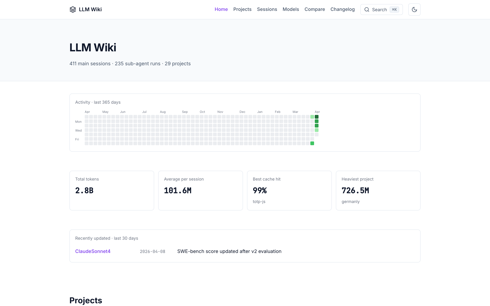
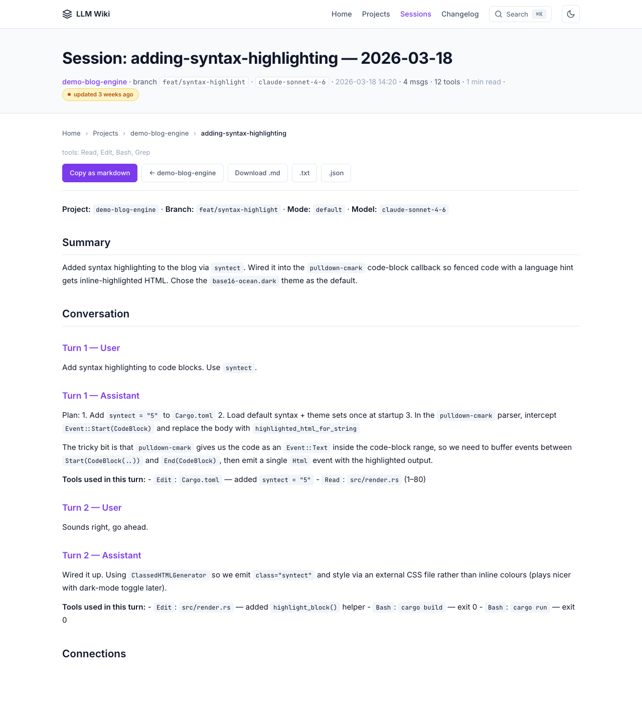
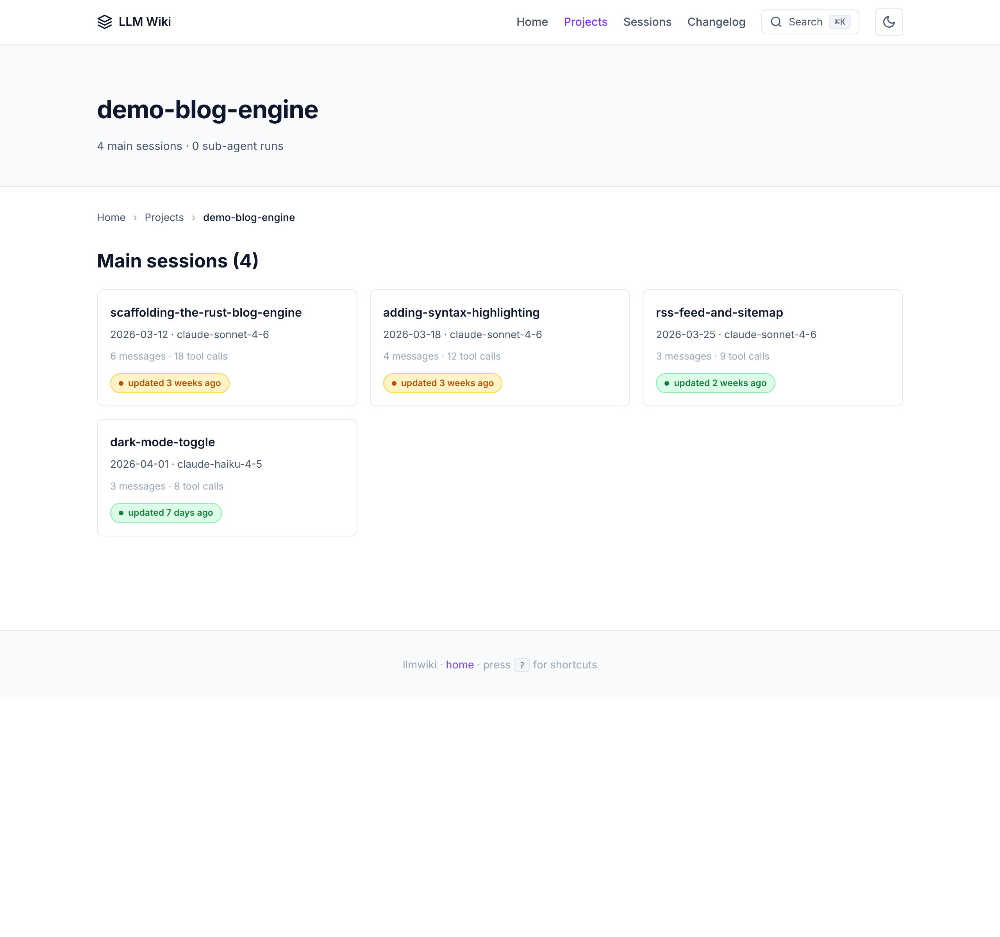

# Setup Guide — Your First LLM Wiki in 15 Minutes

This is the end-to-end tutorial for getting llmwiki running on your machine
and deployed to GitHub Pages. By the end you'll have:

- A local wiki of your Claude Code / Codex / Cursor / Gemini / Copilot sessions
- A static HTML site you can browse at `http://127.0.0.1:8765`
- (Optional) A public GitHub Pages deploy at `https://<user>.github.io/llm-wiki/`
- Your own project topics, model entities, and Obsidian view of the wiki

**Prerequisites:** Python 3.9+, git. That's it. No Node, no Docker, no database.

---

## Part 1: Initial setup (5 minutes)

### 1.1 Clone the repo

```bash
git clone https://github.com/Pratiyush/llm-wiki.git
cd llm-wiki
```

### 1.2 Run the setup script

**macOS / Linux:**
```bash
./setup.sh
```

**Windows:**
```cmd
setup.bat
```

### 1.3 What just happened

The setup script does 5 things:

1. **Creates the 3-layer directory structure** per Karpathy's LLM Wiki pattern:
   - `raw/` — immutable session transcripts (Layer 1)
   - `wiki/` — LLM-maintained pages (Layer 2)
   - `site/` — generated HTML (Layer 3)
2. **Installs `llmwiki`** in editable mode (`pip install -e .`)
3. **Detects your coding agents** and enables matching adapters
   - Looks for `~/.claude/projects/`, `~/.codex/sessions/`, `~/Documents/Obsidian Vault`, etc.
   - Lists which ones are ready, which need paths configured
4. **Offers to install the SessionStart hook** into `~/.claude/settings.json`
   - When accepted, every `claude code` session auto-syncs on launch
5. **Runs a first sync** so you see output immediately

### 1.4 First sync

```bash
llmwiki sync
```

Output looks like:
```
  Claude Code: 142 sessions converted
  Codex CLI:    17 sessions converted
  Cursor:        4 sessions converted
  summary: 163 converted, 0 unchanged, 2 live, 4 filtered, 0 errors
```

`live` means a session was active in the last 60 min — skipped for safety.
Your `raw/sessions/` directory now has one `YYYY-MM-DDTHH-MM-project-slug.md`
file per session.

### 1.5 First build

```bash
llmwiki build
```

Output:
```
  discovered: 163 sources across 12 projects
  wrote site/ (163 sessions, 12 project pages, 1.4 MB HTML)
  wrote search-index.json (45 KB meta) + 12 chunks (220 KB total)
```

### 1.6 First serve

```bash
llmwiki serve
# → http://127.0.0.1:8765
```

Open that URL in your browser. You should see:



---

## Part 2: Understanding the output

### 2.1 Directory anatomy

```
llm-wiki/
├── raw/                          # Layer 1: immutable session transcripts
│   └── sessions/
│       └── 2026-04-15T10-30-my-project-feature-x.md
├── wiki/                         # Layer 2: LLM-maintained wiki (gitignored)
│   ├── index.md                  # catalog of every page
│   ├── log.md                    # append-only operation log
│   ├── overview.md               # living synthesis
│   ├── dashboard.md              # Dataview dashboard (v1.0)
│   ├── MEMORY.md                 # cross-session state (v1.0)
│   ├── sources/                  # one page per raw transcript
│   ├── entities/                 # people, tools, orgs, projects
│   ├── concepts/                 # ideas, patterns, frameworks
│   └── categories/               # tag-based indexes
└── site/                         # Layer 3: generated static HTML
    ├── index.html
    ├── sessions/<project>/<slug>.html
    ├── sessions/<project>/<slug>.txt    # AI-consumable sibling
    └── sessions/<project>/<slug>.json   # AI-consumable sibling
```

### 2.2 What a session detail page shows



- **Hero metadata:** project, model, date, tool calls
- **Tool-calling bar chart:** which tools were used (Read/Write/Edit/Bash/etc.)
- **Token usage card:** input/output/cache hit ratio
- **Conversation:** user messages + assistant replies + tool calls
- **Related pages panel** at the bottom (sibling sessions from the same project)

### 2.3 What a project detail page shows



- Project topics (GitHub-style tag chips)
- Activity heatmap (365 days)
- Tool-usage breakdown across all project sessions
- Total tokens + cache hit ratio
- Sessions grid sorted by date

### 2.4 What the home page shows


- Site-wide activity heatmap
- Token/session stats
- Recently-updated card (pages modified in the last 14 days)
- Projects grid with freshness badges (green/yellow/red based on last touch)

---

## Part 3: Deploying to GitHub Pages

### 3.1 Push to GitHub

```bash
# If you forked the repo
git remote set-url origin https://github.com/<your-user>/llm-wiki.git
git push

# Or create a new repo for your wiki
gh repo create my-llm-wiki --public --source=. --push
```

### 3.2 Enable Pages

**Settings → Pages → Build and deployment:**
- Source: `GitHub Actions`
- (Leave everything else default)

### 3.3 The Pages workflow auto-deploys

The repo ships `.github/workflows/pages.yml`. On every push to `master`:

1. Seeds `raw/sessions/` from `examples/demo-sessions/` (never your personal data)
2. Runs `llmwiki build`
3. Uploads `site/` as a Pages artifact
4. Deploys to `https://<user>.github.io/<repo>/`

**Important:** The public deploy uses demo data, NOT your personal sessions.
Your actual `raw/` and `wiki/` folders are gitignored by default. You ONLY
ship screenshots/examples publicly — your sessions stay local.

### 3.4 Visit your site

```
https://<your-user>.github.io/llm-wiki/
```

First deploy takes 30-60 seconds. Check Actions tab for progress.

---

## Part 4: Customization

### 4.1 Add a project topic

Create `wiki/projects/my-project.md`:

```markdown
---
title: "my-project"
type: entity
entity_type: project
project: my-project
topics: [python, api, fastapi]
description: "My FastAPI CRUD service"
homepage: "https://github.com/me/my-project"
---
```

Rebuild and reload — the project card now shows topic chips.

### 4.2 Add a model entity

llmwiki ships structured model schemas. Create `wiki/entities/MyModel.md`:

```markdown
---
title: "MyModel"
type: entity
entity_type: tool
entity_kind: ai-model
provider: MyProvider
model: {"context_window": 200000, "license": "proprietary", "released": "2026-04-01"}
pricing: {"input_per_1m": 3.00, "output_per_1m": 15.00, "currency": "USD", "effective": "2026-04-01"}
modalities: [text, vision]
benchmarks: {"gpqa_diamond": 0.82, "swe_bench": 0.65}
---

# MyModel

## Connections
- [[Anthropic]]
```

Rebuild — a `/models/` page appears listing every model entity. Pairs are
auto-rendered at `/vs/` for benchmark comparison.

### 4.3 Use Obsidian

```bash
llmwiki link-obsidian --vault ~/Documents/"Obsidian Vault"
```

This symlinks the whole project into your vault. Now:
- Graph view shows every `[[wikilink]]`
- Backlinks panel shows citing pages
- Dataview queries in `wiki/dashboard.md` render live

See [`../obsidian-integration.md`](../obsidian-integration.md) for plugin configs.

### 4.4 Structured search (Cmd+K command palette)

Press `Cmd+K` (macOS) or `Ctrl+K` (Linux/Windows). Try:

| Query | What it does |
|-------|--------------|
| `flutter` | Full-text match |
| `type:session` | Only session pages |
| `project:my-project` | Filter by project |
| `model:claude-sonnet-4` | Filter by model |
| `date:2026-04` | Date prefix match |
| `confidence:>0.8` | High-confidence pages (v1.0) |
| `lifecycle:verified` | By lifecycle state (v1.0) |

### 4.5 Export for other tools

```bash
llmwiki export-obsidian --vault ~/Documents/"Obsidian Vault"   # copy mode
llmwiki export-qmd --out /tmp/my-qmd                            # hybrid search
llmwiki export-marp --topic "my-topic"                          # slide deck
llmwiki export llms-full-txt                                    # paste into any LLM
```

---

## Part 5: Multi-agent setup

llmwiki works with Claude Code, Codex CLI, Copilot Chat, Copilot CLI, Cursor,
Gemini CLI, Obsidian, and PDFs — all in one wiki. Each session gets an agent
badge on the site so you know which AI produced which transcript.

### 5.1 Enable multiple agents

The setup script detects what's installed. To force-enable:

```bash
llmwiki adapters
```

Shows default availability + configured state. Enable opt-in adapters in
`examples/sessions_config.json`:

```json
{
  "meeting": { "enabled": true, "source_dirs": ["~/Meetings"] },
  "jira": { "enabled": true, "server": "https://me.atlassian.net", "email": "me@x.com", "api_token": "..." },
  "pdf": { "enabled": true, "source_dirs": ["~/Documents/PDFs"] },
  "web_clipper": { "enabled": true, "watch_dir": "raw/web" }
}
```

### 5.2 Share skills across agents

```bash
llmwiki install-skills
```

Mirrors `.claude/skills/` into `.codex/skills/` and `.agents/skills/` so
Claude Code, Codex CLI, and any universal-standard agent discover the same
llmwiki skills.

### 5.3 Cross-platform paths

| OS | Claude Code | Codex CLI | Cursor |
|----|-------------|-----------|--------|
| macOS | `~/.claude/projects/` | `~/.codex/sessions/` | `~/Library/Application Support/Cursor/User/workspaceStorage/` |
| Linux | `~/.claude/projects/` | `~/.codex/sessions/` | `~/.config/Cursor/User/workspaceStorage/` |
| Windows | `%USERPROFILE%\.claude\projects\` | `%USERPROFILE%\.codex\sessions\` | `%APPDATA%\Cursor\User\workspaceStorage\` |

llmwiki auto-detects all of these — you usually don't need to configure paths
manually.

---

## Next steps

- **[Obsidian integration guide](../obsidian-integration.md)** — plugins + config
- **[Architecture](../architecture.md)** — 3-layer Karpathy + 8-layer build
- **[Configuration](../configuration.md)** — every tuning knob
- **[Scheduled sync](../scheduled-sync.md)** — daily auto-sync setup per OS
- **[Privacy](../privacy.md)** — redaction rules + `.llmwikiignore`

If you hit a snag, check [GitHub Issues](https://github.com/Pratiyush/llm-wiki/issues) or file a new one.
